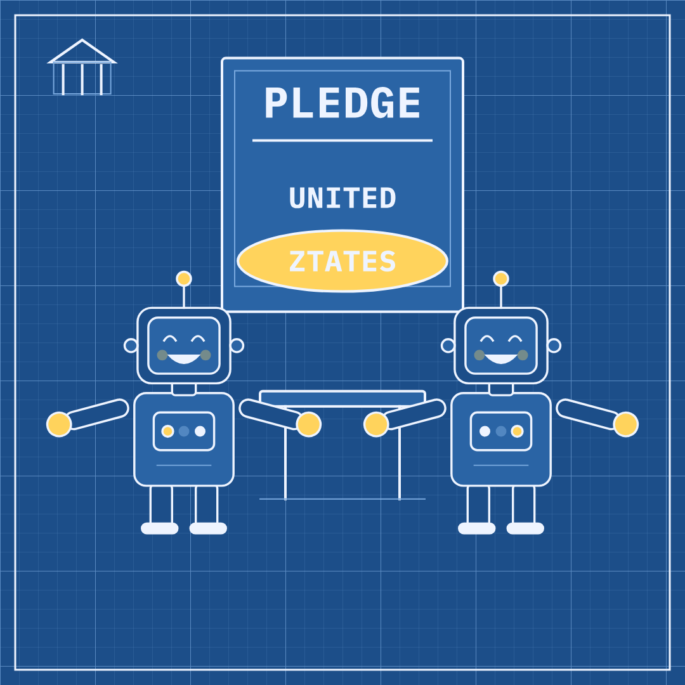

# Slopper #1 — 2026-09-30 — Self-Policing Season

Labels: slopper, fresh

## Self-Policing Season

> The AI companies promised to police themselves on safety. They were so eager that they misspelled the name of the country they promised it to.

**Mode:** fresh · **Style:** blueprint (static)

**Critic:** ✅ passed — average 3.86 after 2 iteration(s) — clarity 4 · coherence 3 · composition 4 · style 5 · polish 3 · novelty 3 · kindness 5
> Passes: the blueprint style is clean and the UNITED/ZTATES typo reads instantly, but the supposed pinky-swear — the whole metaphor of a solemn pledge reduced to a kid's gesture — doesn't actually land because the two inner hands just sit apart on the desk instead of linking.

**Cop:** ✅ pass (no findings)

**Alternatives:**
- Dozens of AI companies promised to watch themselves closely. They watched so closely they misspelled their own country's name.
- A new AI safety deal has no law and no deadline, just one typo in the country's name.
- Tech leaders signed a pledge to grade their own AI safety homework. The homework already has a spelling mistake.
- The government let AI companies police themselves. The first thing they got wrong was the country's name.

Sources

- [Trump plan to combat AI risks hinges on Big Tech pals policing themselves](https://arstechnica.com/tech-policy/2026/09/trump-plan-to-combat-ai-risks-hinges-on-big-tech-pals-policing-themselves/) — Ars Technica
- [Here’s what AI leaders are saying about Trump’s new safety plan](https://www.theverge.com/ai-artificial-intelligence/1002636/ai-execs-trump-self-policing-deal-comments) — The Verge
- [Here’s how tech leaders will self-police AI safety under Trump’s deal](https://www.theverge.com/ai-artificial-intelligence/1002584/trump-us-ai-safety-deal-self-regulation-tech-execs) — The Verge
- [Trump’s AI Safety ‘Accord’ Is a Fancy Pinky-Swear](https://www.wired.com/story/trumps-ai-safety-accord-is-a-fancy-pinky-swear/) — Wired
- [Three takeaways from Trump's 'Super Intelligence' summit](https://www.bbc.co.uk/news/articles/cme30dz5vkzko?at_medium=RSS&at_campaign=rss) — BBC News
- [Pledge signed by President Trump and top AI leaders misspells the United States](https://techcrunch.com/2026/09/30/pledge-signed-by-president-trump-and-top-ai-leaders-misspells-the-united-states/) — techcrunch.com

Labels: add `approved` to publish now, `veto` to block, `regenerate` to try again.
