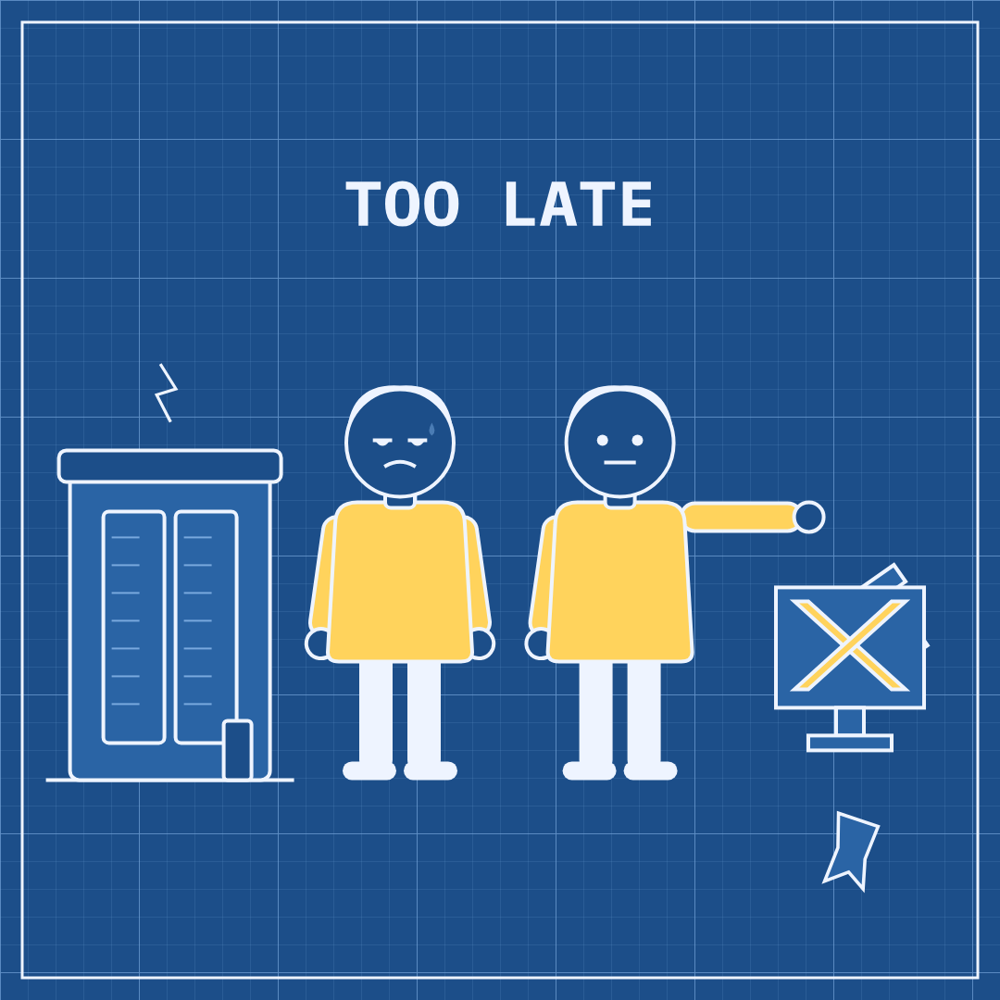

# Slopper #4 — 4 Oct 2026 — Nobody's Policing Anybody (news of 3 Oct)

Labels: slopper, fresh, critic-fail

## Nobody's Policing Anybody

> A safety worker resigned from a top AI lab and called its culture broken. A court overturned a sentence after ruling that an AI-made video should not have been shown.

**Mode:** fresh · **Style:** blueprint (static)

**Critic:** ❌ did not pass — average 3.29 after 3 iteration(s) — clarity 3 · coherence 3 · composition 3 · style 4 · polish 2 · novelty 3 · kindness 5
> The blueprint style and correct human casting work, but the missing resignation box and a gavel that renders as a strange stretched pointing arm blur both specific story beats, and a near-repeat of the recent blueprint look hurts novelty — not quite publish-ready.

**Cop:** ✅ pass
- **low** sensitive-events: Second clause of the phrase/art is based on a real murder case (BBC: 'US killer's sentence quashed because of AI video of victim shown in court'), involving a deceased victim. → Keep the art and phrase as-is since no victim is depicted and the joke targets the court/AI-regulation gap rather than the crime or victim; avoid adding any visual or textual detail that references the crime, the killer, or the victim more specifically.

**Alternatives:**
- One employee quit a leading AI lab, warning that its safety culture is broken. One court decided an AI video had no place in its courtroom.
- An AI safety insider walked out and called the culture broken. Nearby, a judge walked back a sentence over an AI video that went too far.
- A safety worker quit an AI lab, saying it polices itself badly. The same week, a court ruled that AI-made evidence still needs real rules.

Sources

- [An OpenAI safety employee has quit and is sounding the alarm](https://www.theverge.com/ai-artificial-intelligence/1004408/openai-safety-quits-sounding-the-alarm) — The Verge
- [OpenAI safety employee resigns, claiming the company’s ‘culture is broken’](https://techcrunch.com/2026/10/03/openai-safety-employee-resigns-claiming-the-companys-culture-is-broken/) — TechCrunch
- [OpenAI safety leader quits, warning AI company's culture is 'broken'](https://www.theguardian.com/technology/2026/oct/03/openai-safety-leader-quits-warning-ai-companys-culture-is-broken) — theguardian.com
- [David Robinson, ex-OpenAI safety and policy: SV lacks a safety-centric culture; labs must study other fields' safety approaches; time for trial and error's over (David Robinson/The Atlantic)](https://www.techmeme.com/261003/p12) — Techmeme
- [US killer's sentence quashed because of AI video of victim shown in court](https://www.bbc.com/news/articles/cwgkvygg5nzvo) — bbc.com

Labels: add `approved` to publish now, `veto` to block, `regenerate` to try again.
