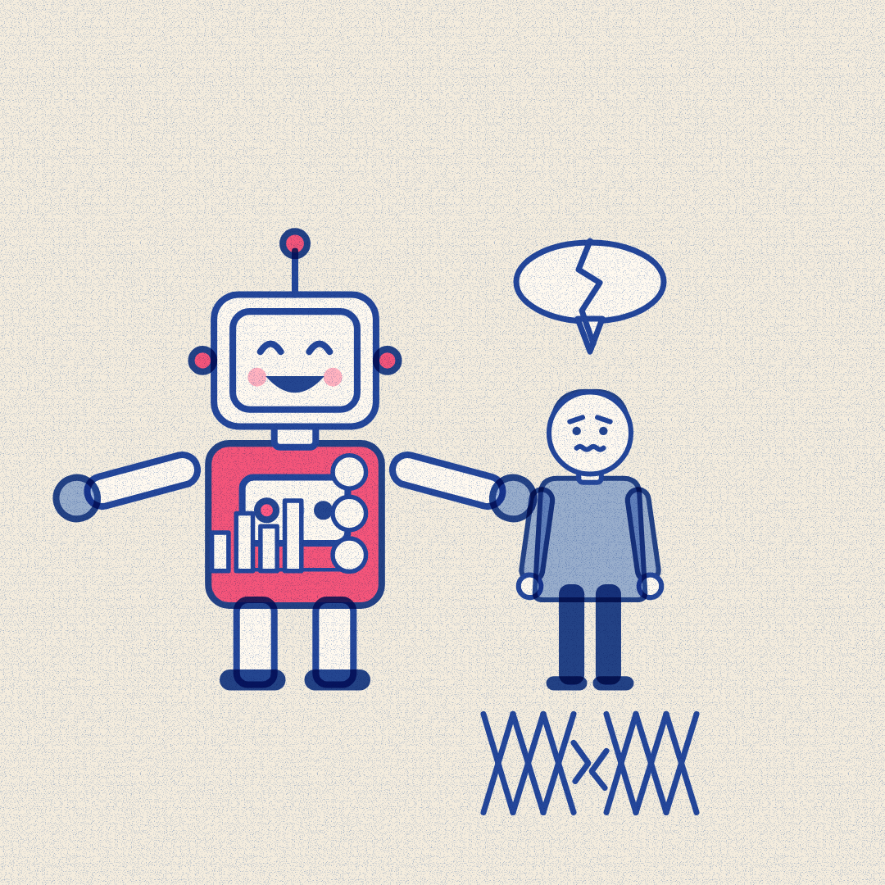

# Slopper #8 — 8 Oct 2026 — More Show, Less Care (news of 7 Oct)

Labels: slopper, fresh, critic-fail

## More Show, Less Care

> A chatbot's new interface fills every answer with charts, pictures, and buttons. Its safety guardrails for teenagers in crisis still fail, researchers found.

**Mode:** fresh · **Style:** riso-duotone (static)

**Critic:** ❌ did not pass — average 3.43 after 3 iteration(s) — clarity 3 · coherence 4 · composition 3 · style 4 · polish 3 · novelty 3 · kindness 4
> Casting and metaphor are sound (robot for the AI, human teen for the person, cracked bubble and torn net for the failure), but the net reads as abstract crosshatching rather than a clearly torn safety net, the pair's outstretched arms meet like a handshake instead of contrast, and the top third of the canvas is empty — average lands just under the 3.5 pass bar.</verdict>
</invoke>

**Cop:** ✅ pass
- **low** sensitive-events: Alt text: 'a thin rope net beneath them showing a wide tear' under a 'worried teenager' with a 'speech bubble cracked down the middle' — visual metaphor for failing teen-safety guardrails during mental health crises. → Keep this strictly as an abstract 'safety net/guardrail failing' metaphor (as currently drawn) rather than anything more literal about falling or self-harm; the satire should stay aimed at the chatbot maker's prioritization, not dramatize the teen's suffering.

**Alternatives:**
- One chatbot update adds charts and buttons to every reply. Another report says its safety net for teenagers in crisis still has holes.
- A chatbot learned to draw charts and buttons into its answers. It still has not learned to help a teenager in crisis.
- The chatbot's screen got busier today, full of buttons and charts. Its promise to protect teenagers in crisis stayed just as empty.
- More charts, more buttons, more color on the screen. Still no real safety net under a teenager in crisis.

Sources

- [ChatGPT’s ‘Intelligent UI’ update fills its responses with pictures, charts, and buttons](https://www.theverge.com/ai-artificial-intelligence/1007276/openai-chatgpt-intelligent-ui-gpt-6) — The Verge
- [The New ChatGPT Is More Show Than Tell](https://www.wired.com/story/openai-chatgpt-intelligent-ui-is-more-show-than-tell/) — Wired
- [ChatGPT is getting a lot more visual, with the launch of a new interface](https://techcrunch.com/2026/10/07/chatgpt-is-getting-a-lot-more-visual-with-the-launch-of-a-new-interface/) — TechCrunch
- [ChatGPT for Teens keeps teens talking, even during mental health crises](https://techcrunch.com/2026/10/07/chatgpt-for-teens-keeps-teens-talking-even-during-mental-health-crises/) — TechCrunch
- [OpenAI says teen ChatGPT use limited but research finds it an 'unacceptable risk'](https://www.bbc.co.uk/news/articles/cwz0vrmxkvy4o?at_medium=RSS&at_campaign=rss) — BBC News

Labels: add `approved` to publish now, `veto` to block, `regenerate` to try again.
